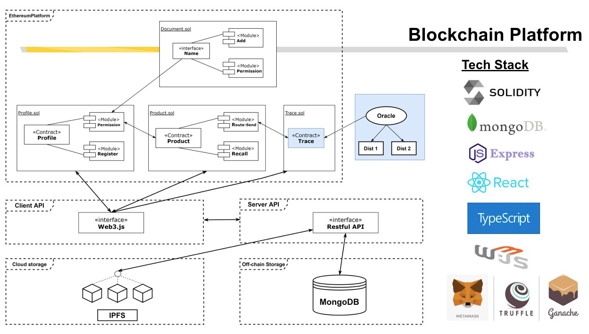
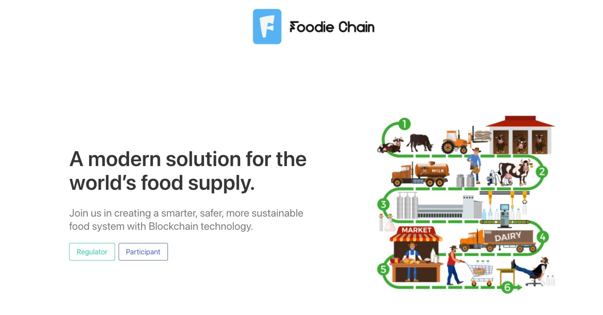
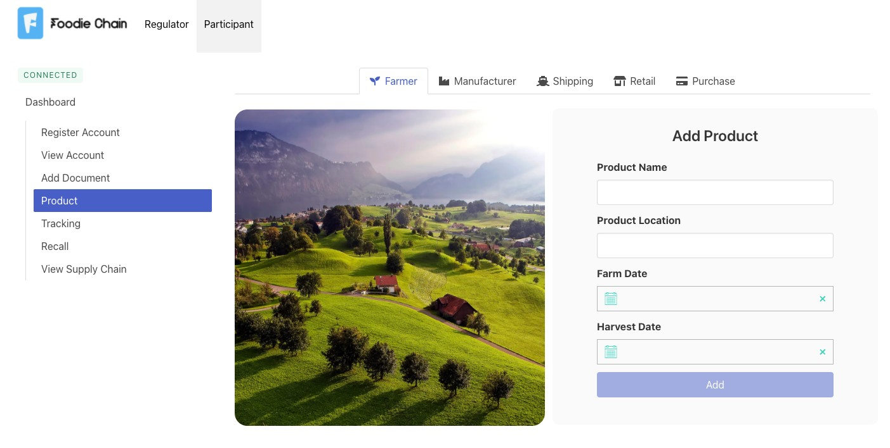

# Foodie Chain
Foodie Chain is a full-stack Blockchain application written in Solidity for Smart Contracts, MongoDB, Express (TypeScript), React (TypeScript), NodeJS, Bulma CSS, Truffle, Jest and Mocha.
The chosen domain for this app is "Food Supply Chain". There are challenges currently in the food industry where (1) it is difficult to recall contaminated products quickly, (2) lack of transparency and traceability of information and, (3) food tampering, fraud, and deceptive advertising.
Our objective is to solve these problems with the blockchain technology.

This is a group project for COMP6452 - Software Architecture for Blockchain Applications @UNSW. Credits also to [Ammie](https://github.com/AmyMoominz), [Ken](https://github.com/rittisak-kwanda) and [Niko](https://github.com/n1k0ver3E) for their great contributions to get this across the line.

## System Architecture


## Preview
**Landing Page**


**Products Page for Farmer**


## Usage
- NPM
- Node v16
- [Ganache](https://www.trufflesuite.com/ganache)

Ensure that you have npm installed. On the root directory of every projects, run the below command to install the dependencies:

```
$ npm install
```


### Solidity
1. Navigate to the solidity folder
   ```
   $ cd solidity 
   ```

2. Compiling contract

   Select the contract you want to compile in the `/migrations/2_deploy_contracts.js` file. On the root directory, run:

   ```
   $ npm run compile
   ```

3. Truffle Develop shell and contract migration

   Open up the truffle develop shell, run:

   ```
   $ npm run develop
   ```

   At this point you should see the list of **account addresses**, **private keys** and **mnemonics**.
   Take notes of this mnemonics.

4. Open up Ganache and configure a new workspace for foodie-chain. One of the requirements is that it should ask you to enter the mnenomics to link it to your local environment. The RPC Server on Ganache should be `http://127.0.0.1:7545/`.

5. Configure meta-mask on the chrome extension to point to `http://127.0.0.1:7545/`. There's an article that provides instructions on how to configure meta-task, which you can find [here](https://medium.com/fullstacked/connect-react-to-ethereum-b117986d56c1).

6. Migrate the smart contracts
   ```
   $ npm run migrate
   ```

### Server
1. Navigate to the server folder

    ```
    $ cd server
    ```

2. Run app (Port 5000)

    ```
    $ npm run server
    ```
3. Config the server/secrets.json. The file secrets.json.example is the template
    ```
    // server/secrets.json
    {
        "mnemonic": "Please insert the oracle/logistic mnemonic",
        "blockchainUrl": "ws://localhost:9545"
    }
    ```

4. Open a new terminal and run the reverse oracle for trace

    ```
    $ npm run trace-oracle
    ```

5. Open another terminal and run the oracle for trace

    ```
    $ npm run oracle
    ```


### Client
**Run App Locally**

1. Navigate to the client folder

    ```
    $ cd client
    ```

2. Run app (Port 3000)

    ```
    $ npm run start
    ```

